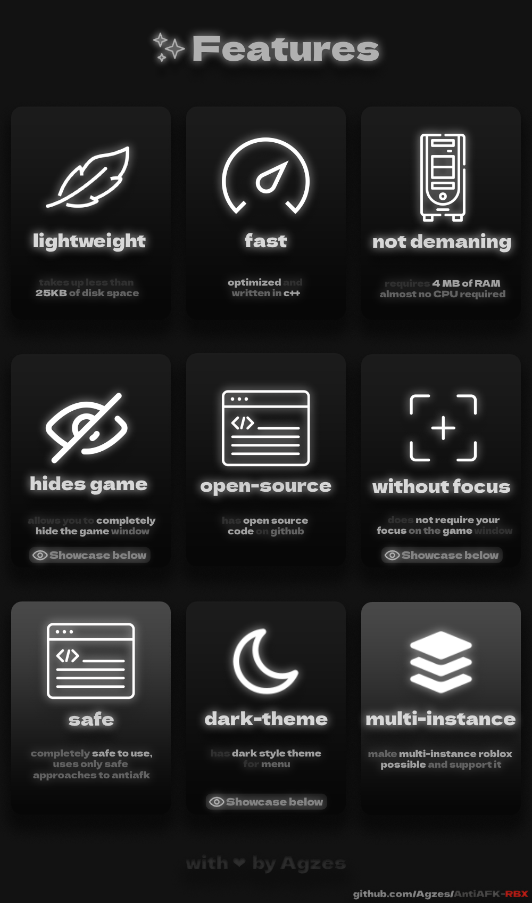
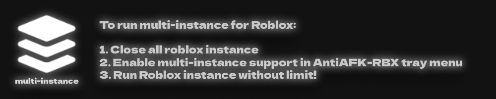

`⚠️ • this is old version of readme` \
[`🖼️ • see new`](https://github.com/Agzes/AntiAFK-RBX)

  

https://github.com/user-attachments/assets/2ecd83fb-2455-428d-ae77-116667c3dd93

https://github.com/user-attachments/assets/58638b1b-14c7-4cd7-adb3-b52651c48754

https://github.com/user-attachments/assets/1f990133-a922-424f-ab9a-2f9fe94f5236

