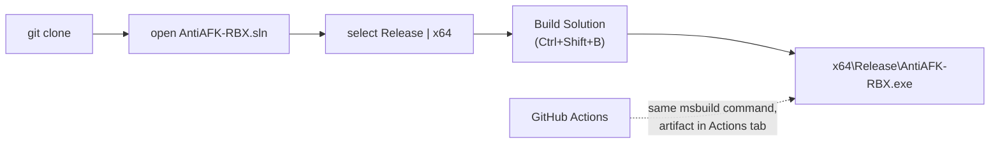

<a href="https://github.com/Agzes/AntiAFK-RBX/wiki/"><kbd><- Go to Wiki</kbd></a>

<div align="center">
    <h1>AntiAFK-RBX • How To Compile?</h1>
</div>

## Overview

AntiAFK-RBX is a native Win32 application written in **one C++ file** (`AntiAFK-RBX.cpp`) with plain WinAPI + GDI+. There are **no third-party libraries, no package managers, no external dependencies** - everything needed ships with Visual Studio. Since **v3.2.0** the repository includes a ready-to-build Visual Studio solution.



## Requirements

| Requirement            | Details                                                                  |
| ---------------------- | ------------------------------------------------------------------------ |
| **Visual Studio 2026** | project uses platform toolset **v145**                                   |
| Workload               | _Desktop development with C++_                                           |
| Windows SDK            | any recent Windows 10/11 SDK (project auto-selects the latest installed) |
| OS                     | Windows 10/11 x64                                                        |

> Using **Visual Studio 2022**? The solution will refuse to open its toolset (`error MSB8020: v145 not found`). Either install VS 2026, or double-click the solution in Solution Explorer → **Retarget Solutions** → pick your installed toolset (v143 works fine).

## Step by step (IDE)

1. **Get the source**

    ```bat
    git clone https://github.com/Agzes/AntiAFK-RBX.git
    ```

    ...or download the repository ZIP, or press _Code → Open with Visual Studio_ on GitHub.

2. **Open `AntiAFK-RBX.sln`** - always through the solution file, not the loose `.cpp`.

3. Set the configuration to **`Release` | `x64`** in the top toolbar. (The project is x64-only; there are no Win32 configurations.)

4. **Build → Build Solution** (`Ctrl+Shift+B`). First build takes a while - it is one large translation unit compiled with optimizations.

5. Find the result at **`x64\Release\AntiAFK-RBX.exe`** (Debug builds land in `x64\Debug`). Run it - the tray icon appears near the clock.

## Step by step (command line)

Open **Developer PowerShell for VS**, then:

```bat
cd AntiAFK-RBX
msbuild AntiAFK-RBX.sln /p:Configuration=Release /p:Platform=x64 /m
```

This is the exact same command the project's own [CI workflow](https://github.com/Agzes/AntiAFK-RBX/blob/preview/.github/workflows/build.yml) runs on every push to `preview`.

## Project facts

| Property       | Value                                                                                    |
| -------------- | ---------------------------------------------------------------------------------------- |
| Standard       | C++20 (`/std:c++20`), C17                                                                |
| Character set  | Unicode                                                                                  |
| Subsystem      | Windows (`WinMain`)                                                                      |
| Toolset / SDK  | v145, latest Windows 10 SDK                                                              |
| Configurations | `Debug\|x64`, `Release\|x64` only                                                        |
| Resources      | `AntiAFK-RBX.rc` + `resource.h` + icons in `Resources/` (tray icons, logo, version info) |

Libraries are linked automatically via `#pragma comment(lib, ...)`: `psapi`, `dwmapi`, `winmm`, `Gdiplus`, `WinInet`, `Comdlg32`, `msimg32` - nothing to configure manually.

## Distributing your build

- The binary is statically laid out but uses the **dynamic CRT**: machines without Visual Studio need the [Visual C++ Redistributable](https://learn.microsoft.com/en-us/cpp/windows/latest-supported-vc-redist), otherwise users get _"MSVCP140.dll is missing"_.
- Windows SmartScreen may warn on unsigned self-built executables - this is expected.
- Settings live in the Registry (`HKCU\Software\Agzes\AntiAFK-RBX`), macros in `%APPDATA%\AntiAFK-RBX` - a fresh build picks them up automatically.

## Troubleshooting

| Problem                                                    | Fix                                                                           |
| ---------------------------------------------------------- | ----------------------------------------------------------------------------- |
| `MSB8020: build tools for v145 cannot be found`            | retarget the solution to your installed toolset (see note above)              |
| `C1083: Cannot open include file 'winsdk...'` / SDK errors | install the **Windows 10/11 SDK** component via VS Installer                  |
| Weird syntax errors around unicode strings                 | open the solution as-is; do not convert/re-save `AntiAFK-RBX.cpp` encodings   |
| Antivirus flags freshly built exe                          | typical for unsigned input-simulation tools; verify the source you built from |
